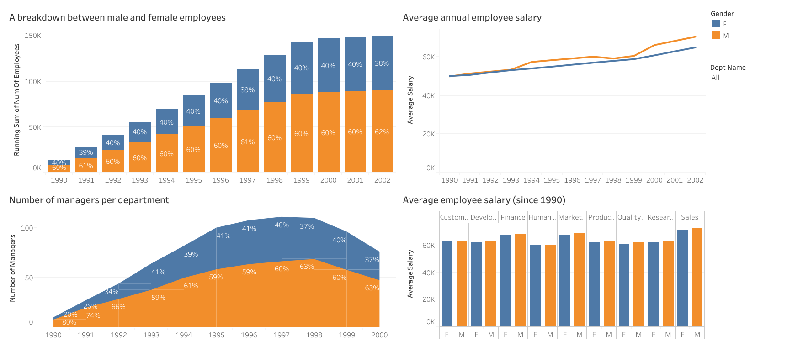

# SQL and Tableau Analysis Tasks

This repo contains the outputs of several tasks that I completed as part of an Udemy course to further improve my data querying, analysis and visualisation skills. Although the Udemy course, "SQL - MySQL for Data Analytics and Business Intelligence", uses MySQL, I have used PostgreSQL for my analysis and Tableau for the data visualisation. 

Each task is explained below followed by the SQL query to retrieve the relevant dataset from the database, in order to answer the posed question and for data visualisation. 

Feel free to download and run the [employees_mod_postgresql.sql](employees_mod_postgresql.sql) file to create the database and its records. Note that this data is modified from the original MySQL Employee Sample Database. The other SQL files contain the same SQL queries as outlined below and the CSV files are the outputs of the queries, which are used to create understandable visualisations in Tableau. A screenshot of the data visualisation dashboard in Tableau is shown below and the interactive dashboard can be found at [Tableau Public](https://public.tableau.com/views/SQLTasks_15969830555650/Dashboard1?:language=en&:display_count=y&publish=yes&:origin=viz_share_link).

[](https://public.tableau.com/views/SQLTasks_15969830555650/Dashboard1?:language=en&:display_count=y&publish=yes&:origin=viz_share_link)

## Task 1
**Request:** 

Create a visualization that provides a breakdown between the male and female employees working in the company each year, starting from 1990.

**SQL Query:** 
```sql
SELECT   EXTRACT (YEAR FROM a.from_date) AS calendar_year,
         b.gender,
         COUNT(b.emp_no) AS num_of_employees
FROM     t_dept_emp AS a
         JOIN t_employees b
           ON a.emp_no = b.emp_no
GROUP BY calendar_year, b.gender
HAVING   EXTRACT (YEAR FROM a.from_date) >= 1990;
```

**Visualisation:**

Top left chart on the [dashboard](https://public.tableau.com/views/SQLTasks_15969830555650/Dashboard1?:language=en&:display_count=y&publish=yes&:origin=viz_share_link), "A breakdown between male and female employees", shows that the proportion of male to female employees remained consistent at 3:2 even as the number of total employees grew over time.

## Task 2
**Request:** 

Compare the number of male managers to the number of female managers from different departments for each year, starting from 1990.

**SQL Query:** 
```sql
SELECT   c.dept_name,
         d.gender,
         b.emp_no,
         b.from_date,
         b.to_date,
         a.calendar_year,
         CASE WHEN EXTRACT (YEAR FROM b.to_date) >= a.calendar_year
              AND EXTRACT (YEAR FROM b.from_date) <= a.calendar_year
              THEN 1
              ELSE 0
              END AS active
FROM     (SELECT EXTRACT (YEAR FROM hire_date) AS calendar_year
          FROM t_employees
          GROUP BY calendar_year) AS a
         CROSS JOIN t_dept_manager AS b
         JOIN t_departments AS c
           ON b.dept_no = c.dept_no
         JOIN t_employees AS d
           ON b.emp_no = d.emp_no
ORDER BY b.emp_no, calendar_year;
```

**Visualisation:**

Bottom left chart on the [dashboard](https://public.tableau.com/views/SQLTasks_15969830555650/Dashboard1?:language=en&:display_count=y&publish=yes&:origin=viz_share_link), "Number of managers per department", shows that in 1990 that there were only 2 female managers and 8 male managers so only 20% of managers in the whole company were female. The number of female managers gradually increased over time and reached a peak of 44 managers in 1996 and 1997 with proportion of 41% and 40% respectively of total managers. To check out the breakdown for specific departments, you can use the department filter on the right hand side of the interactive dashboard. This will also change the right hand side charts as well. 

## Task 3
**Request:** 

Compare the average salary of female versus male employees in the entire company until year 2002, and add a filter allowing you to see that per each department.

**SQL Query:** 
```sql
SELECT   a.gender,
         ROUND(AVG(b.salary), 2) AS salary,
         EXTRACT (YEAR FROM b.from_date) AS calendar_year,
         d.dept_name
FROM     t_employees AS a
         JOIN t_salaries AS b
           ON a.emp_no = b.emp_no
         JOIN t_dept_emp AS c
           ON a.emp_no = c.emp_no
         JOIN t_departments AS d
           ON c.dept_no = d.dept_no
GROUP BY d.dept_no, a.gender, calendar_year
HAVING   EXTRACT (YEAR FROM b.from_date) <= 2002
ORDER BY d.dept_no
```

**Visualisation:**

Top right chart on the [dashboard](https://public.tableau.com/views/SQLTasks_15969830555650/Dashboard1?:language=en&:display_count=y&publish=yes&:origin=viz_share_link), "Average annual employee salary", shows that the salaries, on the whole, have been increasing constantly for any department over the time period. Furthermore, male and female employees' average salaries were similar until 1993, and thereafter, male employees earned more per year than female employees. To check out the breakdown for specific departments, you can use the department filter on the right hand side of the interactive dashboard. This will also change the bottom charts as well.

## Task 4
**Request:** 

Create an SQL function that will allow you to obtain the average male and female salary per department within a certain salary range. Let this range be defined by two values the user can insert when calling the function.

**SQL Query:** 
```sql
DROP FUNCTION IF EXISTS filter_salary;

CREATE OR REPLACE FUNCTION filter_salary (IN p_min_salary DOUBLE PRECISION, IN p_max_salary DOUBLE PRECISION)
RETURNS TABLE (gender gender, dept_name VARCHAR(40), avg_salary NUMERIC)
AS $$
BEGIN
RETURN QUERY(SELECT   b.gender,
                      d.dept_name,
                      ROUND(AVG(a.salary), 0) AS avg_salary
             FROM     t_salaries AS a
                      JOIN t_employees AS b
                        ON a.emp_no = b.emp_no
                      JOIN t_dept_emp AS c
                        ON b.emp_no = c.emp_no
                      JOIN t_departments AS d
                        ON c.dept_no = d.dept_no
             WHERE    a.salary BETWEEN p_min_salary AND p_max_salary
             GROUP BY d.dept_no, b.gender);
END;
$$ LANGUAGE plpgsql;

SELECT * FROM filter_salary(50000, 90000);
```

**Visualisation:**

Bottom right chart on the [dashboard](https://public.tableau.com/views/SQLTasks_15969830555650/Dashboard1?:language=en&:display_count=y&publish=yes&:origin=viz_share_link), "Average employee salary (since 1990)", shows the average male and female salary per department within the range $50,000 and $90,000. It appears that Sales, Marketing and Finance had the highest average salaries since 1990. To check out the breakdown in more detail for specific departments, you can use the department filter on the right hand side of the interactive dashboard. This will also change the bottom left and top right charts as well.
